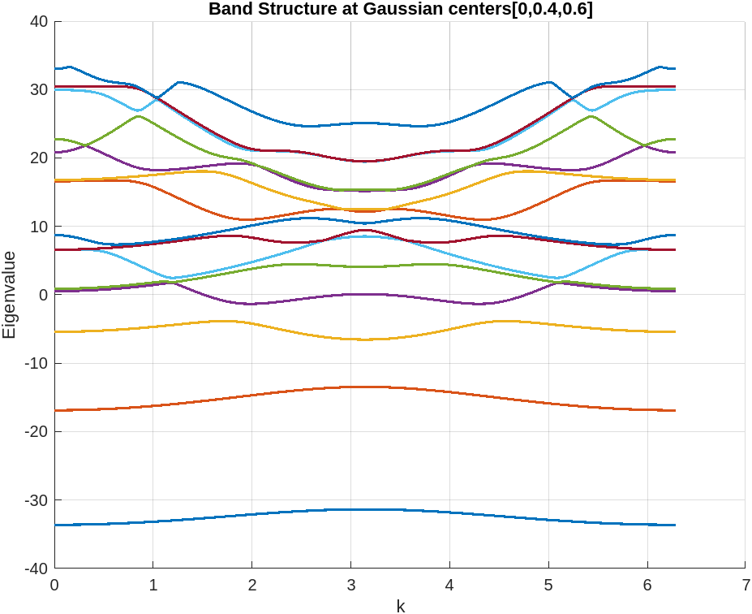

# Approximation of the Schrödinger Equation of 2D Materials
This repository provides the foundation for solving the Schrödinger equation of 2D materials. 
The approach is based on Bloch theory, with the potential term modeled using a generalized Kronig-Penney model.

The Hamiltonian of the Schrodinger Equation Hψ = Eψ is H = -∂²/∂x² - ∂²/∂z² + V(x, z),

where the potential based on Kronig Penny Model is given by:

V(x, z) = Σᵢ Σₗₙ V₀ⁱ δₑ(x + bᵢ - nᵢ) exp(-(z + Llᵢ)²ηᵢ).
The Gaussian function is defined as δₑ(x) = 1 / √(2π) e⁻(x² / 2ε²).

The matrix equation is given by:

ℋⱼ'ₘ',ⱼₘ cⱼₘ = Eₙₖ cⱼ'ₘ'

where ℋⱼ'ₘ',ⱼₘ represents the matrix elements of the Hamiltonian. Solving this matrix equation provides the eigenvalues Eₙₖ (the energy) and the eigenvectors cⱼₘ.

The matrix elements of the Hamiltonian are expressed as:

ℋⱼ'ₘ',ⱼₘ = [(k - 2πm')² + (4π²j'²) / L²] δⱼⱼ' δₘₘ'
          + (√(π / ηᵢ))(V₀ⁱ εᵢ / L) e^(-π²(|j - j'|)² / (ηᵢL²)) 
            e^(-2π²(m - m')² εᵢ²) e^(2πi(m - m')bᵢ)

By taking the truncations as:

|m| ≤ Nₓ, |j| ≤ N𝓏, Nₖ, k ∈ [0, 2π]

# Observations:
If the centers of the Gaussian functions are taken as [0, 0.4, 0.6], there are three isolated bands below the Fermi level, each separated by a band gap. However, we obtain one isolated and two entangled bands if the centers are taken at one-third ratios, i.e., [0, 0.33, 0.66]. Since all these bands are truncated within a certain value, we observe band folding in the given range.
